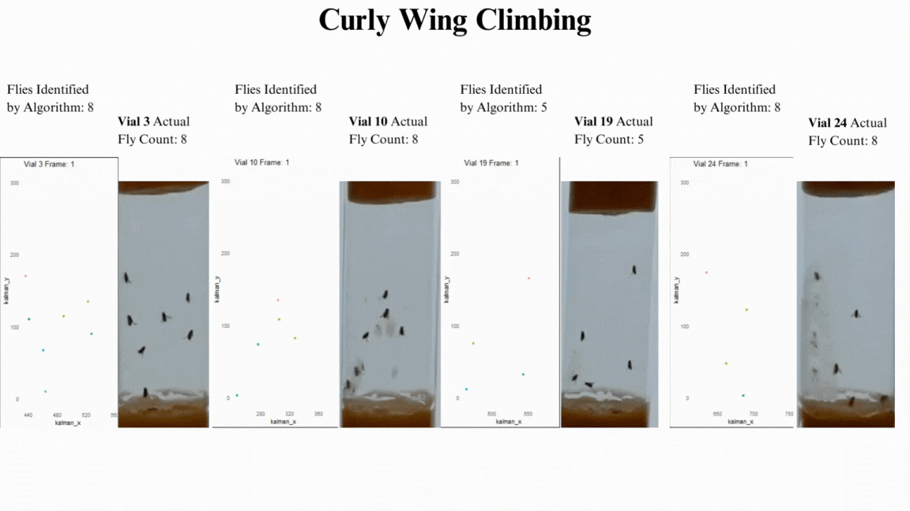
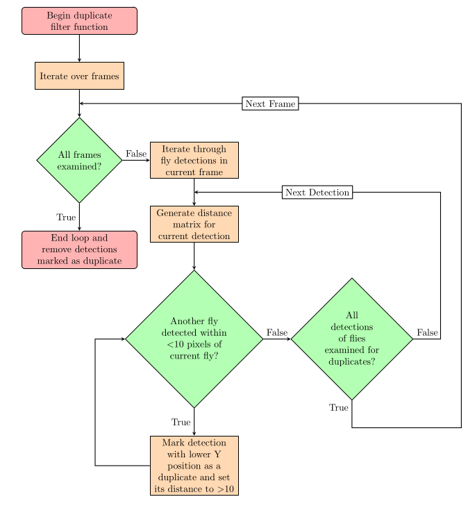
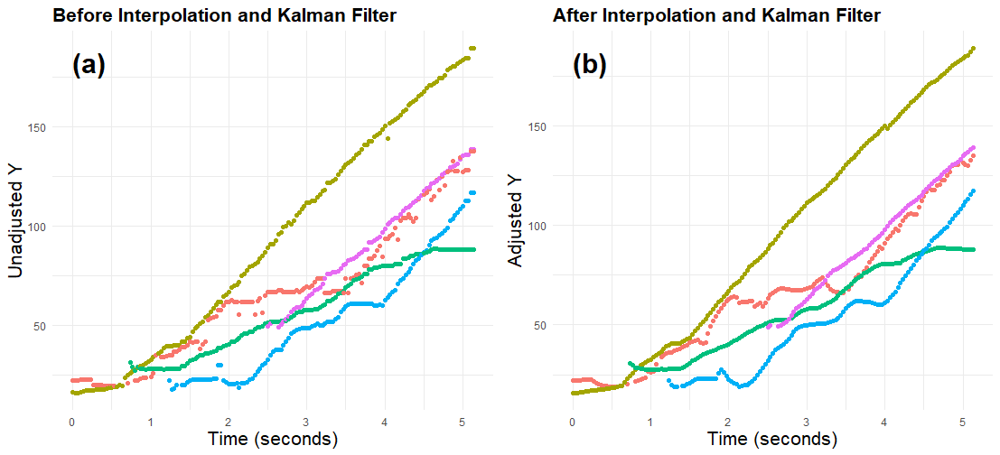
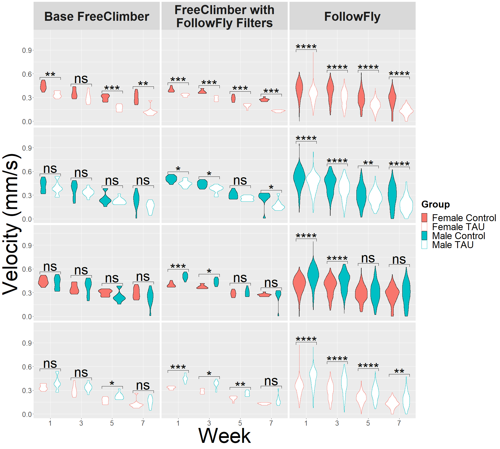

# FollowFly

`FollowFly` is an R package add-on to [FreeClimber](https://github.com/adamspierer/FreeClimber) that tracks **individual flies** from FreeClimber detections and estimates climbing velocity from individual trajectories.

FollowFly was developed to extend FreeClimber from vial-level summaries to fly-level tracking. Instead of estimating climbing behavior from all detections in a vial at once, FollowFly builds trajectories for individual flies, fills short detection gaps, smooths tracks, and calculates velocity for each fly separately. 



## Why FollowFly?

FreeClimber is an effective tool for detecting flies and quantifying climbing behavior, but it is not designed to maintain the identity of individual flies across frames. FollowFly adds that layer.

This makes it possible to:

- estimate velocity for individual flies rather than only vial means;
- reduce error from duplicate detections and short detection gaps;
- filter out non-climbing or weakly tracked individuals;
- retain full trajectories for downstream analyses beyond climbing velocity.

## Workflow

FollowFly processes FreeClimber output in four main stages:

1. filter likely duplicate detections within frames;
2. assign persistent fly identities across frames;
3. fill short gaps and smooth trajectories with linear interpolation and a Kalman filter;
4. estimate velocity from the most linear 30-frame segment of each trajectory.

## Methods overview

### Duplicate detection filter

Before tracking begins, FollowFly identifies detections within a frame that are implausibly close together and flags them as potential duplicates. This reduces over-counting and improves frame-to-frame matching.



### Track repair and Kalman smoothing

After tracks are built, missing frames are filled by interpolation and trajectories are smoothed with a Kalman filter. This reduces jitter and produces more continuous paths.



### Velocity estimation

Velocity is calculated for each fly with a moving-window ordinary least squares regression over `kalman_y ~ frame`. By default, FollowFly uses a 30-frame window and reports the slope from the window with the highest `R^2`.

## Example application

FollowFly was evaluated in a Drosophila climbing experiment comparing control flies with flies expressing neuronal human tau. Because FollowFly estimates velocity at the level of individual flies, it can substantially increase sample size and improve power relative to vial-level summaries alone.



## Installation

From a local source archive:

```r
install.packages("FlyTrackPACK_0.2.0.tar.gz", repos = NULL, type = "source")
```

From GitHub:

```r
remotes::install_github("YOUR_GITHUB_USERNAME/FlyTrackPACK")
```

## Usage

```r
library(FlyTrackPACK)

trackedDF <- read.csv("experiment.raw.csv")
results <- run_flytrack(trackedDF, seed = 1)

final_base_trackedDF <- results$base_tracks
final_Kalman_trackedDF <- results$kalman_tracks
final_slope_dataset <- results$slopes
```

Input data should contain:

- `x`
- `y`
- `frame`
- `vialID`
- `day`
- `pos`
- `batch`

FreeClimber `*.raw.csv` files and concatenated datasets with the same columns are supported.

## Outputs

`run_flytrack()` returns a list with three main outputs:

- `base_tracks`: frame-by-frame fly identity assignments;
- `kalman_tracks`: interpolated and smoothed trajectories;
- `slopes`: velocity estimates for each fly.

The primary velocity measurement is `kalman_y_slope` in `results$slopes`.

## Notes

- Unless coordinates were converted beforehand, slope values are in coordinate units per frame rather than cm/s.
- The current defaults preserve the original workflow: duplicate detections are filtered within 15 coordinate units, track assignments farther than 20 units are treated as new flies, ghost tracking uses up to 10 recent frames, the Kalman model assumes 30 fps, and slope analysis uses a 30-frame window with an `R^2` cutoff of 0.8.

## Published use

An earlier version of the FollowFly workflow was used to estimate individual-fly climbing velocities in:

Harrison, B. R., Sun, Y., Nonacs, T., Shankar, H., Djukovic, D., Raftery, D., & Promislow, D. E. L. (2026). **Early-Life Climbing Stratifies the Metabolome and Mortality Risk in Genetically Identical Flies.** *Aging Cell*, 25(1), e70299. https://doi.org/10.1111/acel.70299

Code and data from the study are available at [ben6uw/Harrison-et-al-2025-Climbers](https://github.com/ben6uw/Harrison-et-al-2025-Climbers).
